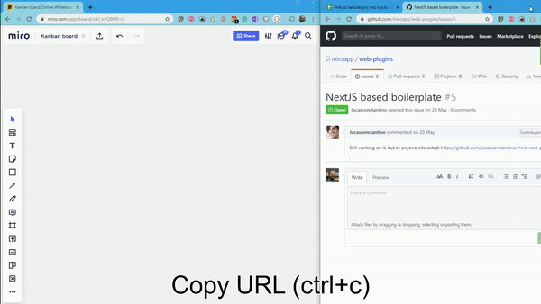
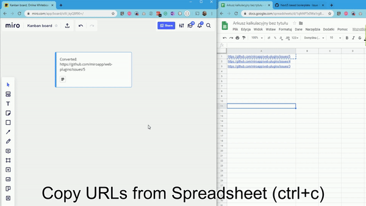

# How to intercept pasted URL's
With this trick you can intercept pasted URL's and based on them perform some action. For instance when creating a plugin for your ticket tracking system
you can intercept someone pasting url to an issue from your system to create a card with all the additional details you could pull underneath. 

### Copy pasting single URL

### Copy pasting multiple URL's from spreadsheet

## How does it work?
It listens for when widget is created. This can end up with either a PREVIEW or a STICKER object as far as I have observed [can be exteneded
if needed]. If those contain a text that starts with `http` it converts this object to CARD with text "Converted: {pasted URL}".

If you would really want to use it I guess it would be good to go for some regexps to actually catch url's you are interested in.

## Why?
I really like how the Jira cards plugin works that when you paste an URL to Jira ticket it automatically
creates a Jira card in Miro. As there is no API exposed to hook into I was looking for a way around this and this is what I came up with.
With this plugin users can build interactive prototypes like in InVision or Overflow.
Very comprehensive example for a lot of SDK capabilities, including experimental features.

